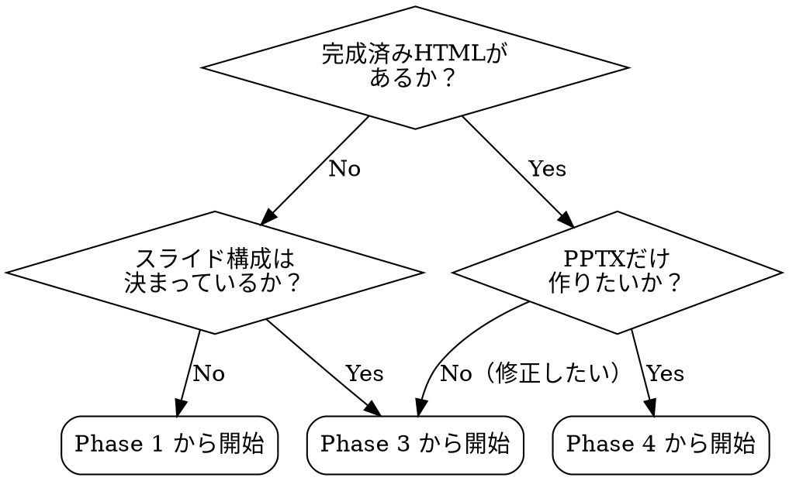
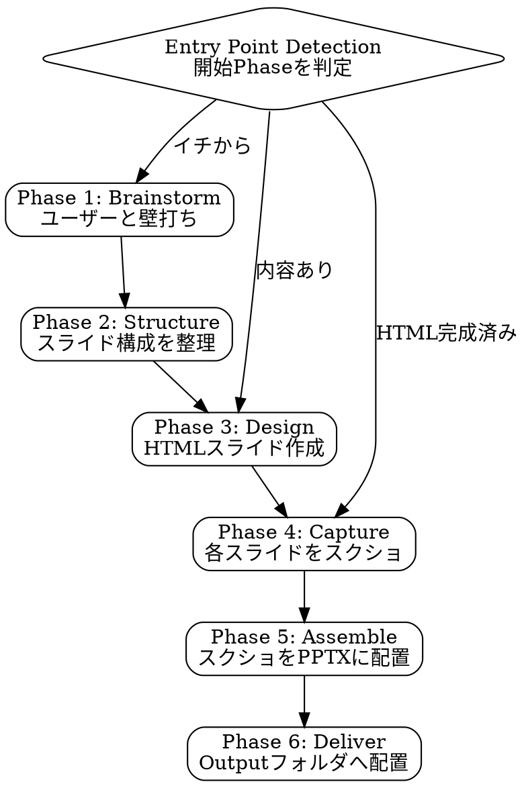

# Slides to PPTX

## Overview

HTMLスライドをスクリーンショット経由でPPTXに変換するワークフロー。デザインの劣化ゼロでPowerPointを生成する。

**Core principle:** HTML で見た目を完璧に作り込み、スクショで PPTX に焼き付ける。python-pptx の描画制約に縛られない。

---

## Phase 0: Setup Check（スキル起動時に必ず実行）

**スキル起動直後、他のフェーズに入る前に必ずこのチェックを実行する。**

以下のコマンドを順番に実行し、不足があればその場でユーザーに案内する。

### チェックスクリプト

```bash
# 1. Google Chrome の存在確認
ls "/Applications/Google Chrome.app" > /dev/null 2>&1 && echo "✅ Chrome: OK" || echo "❌ Chrome: NOT FOUND"

# 2. Python ライブラリの確認
python -c "import playwright; print('✅ playwright: OK')" 2>/dev/null || echo "❌ playwright: NOT FOUND"
python -c "import pptx; print('✅ python-pptx: OK')" 2>/dev/null || echo "❌ python-pptx: NOT FOUND"

# 3. Playwright の Chromium バイナリ確認
python -c "
from playwright.sync_api import sync_playwright
with sync_playwright() as p:
    path = p.chromium.executable_path
    import os
    print('✅ Playwright Chromium: OK') if os.path.exists(path) else print('❌ Playwright Chromium: NOT FOUND')
" 2>/dev/null || echo "❌ Playwright Chromium: NOT FOUND"

# 4. frontend-slides スキルの確認
ls ~/.claude/skills/frontend-slides/SKILL.md > /dev/null 2>&1 && echo "✅ frontend-slides skill: OK" || echo "❌ frontend-slides skill: NOT FOUND"
```

### 結果に応じた対応

| 結果 | 対応 |
|------|------|
| すべて ✅ | そのまま Entry Point Detection へ進む |
| ❌ が1つ以上 | **作業を止めて**ユーザーに不足を報告し、以下のインストール手順を案内する |

### 不足時のユーザー案内メッセージ例

```
以下のセットアップが必要です。一括でインストールしますか？

❌ playwright
❌ frontend-slides skill

【一括インストールコマンド】
pip install playwright python-pptx
playwright install chromium
git clone https://github.com/zarazhangrui/frontend-slides /tmp/fs
mkdir -p ~/.claude/skills/frontend-slides
cp /tmp/fs/SKILL.md /tmp/fs/Style_presets.md ~/.claude/skills/frontend-slides/
rm -rf /tmp/fs

インストールが完了したら「完了」と教えてください。確認後、作業を再開します。
```

インストール完了の報告を受けたら、チェックを再実行して全 ✅ を確認してから次へ進む。

---

## Setup 詳細（参考）

このスキルを使う前に以下をすべて揃えること。

### 必須ツール

| ツール | 用途 | インストール |
|--------|------|-------------|
| Google Chrome | 実ブラウザでのレンダリング | [chrome.google.com](https://www.google.com/chrome/) からインストール |
| Playwright | スライドのスクリーンショット撮影 | `pip install playwright && playwright install chromium` |
| python-pptx | スクショからPPTX生成 | `pip install python-pptx` |

### 必須スキル

| スキル | 用途 | インストール |
|--------|------|-------------|
| `frontend-slides` | HTMLスライドのデザイン生成 | [github.com/zarazhangrui/frontend-slides](https://github.com/zarazhangrui/frontend-slides) をクローンし `SKILL.md` と `Style_presets.md` を `~/.claude/skills/frontend-slides/` に配置 |

### 一括セットアップコマンド

```bash
# Python ライブラリ
pip install playwright python-pptx
playwright install chromium

# frontend-slides スキル
git clone https://github.com/zarazhangrui/frontend-slides /tmp/frontend-slides
mkdir -p ~/.claude/skills/frontend-slides
cp /tmp/frontend-slides/SKILL.md ~/.claude/skills/frontend-slides/
cp /tmp/frontend-slides/Style_presets.md ~/.claude/skills/frontend-slides/
rm -rf /tmp/frontend-slides
```

### 動作確認

```bash
python -c "import playwright, pptx; print('OK')"
ls ~/.claude/skills/frontend-slides/SKILL.md
```

両方通ればセットアップ完了。

---

## When to Use

- プレゼン資料・提案書を作りたいとき
- PowerPoint 形式での納品が必要なとき
- デザイン品質を妥協したくないとき

## When NOT to Use

- PPT上でテキスト編集が必須の場合（画像ベースのため編集不可）
- 既存PPTXの修正・更新のみの場合

## Entry Point Detection

**スキル起動時、まずユーザーの状況を確認して開始Phaseを決定する。**



**判定ルール:**
- ユーザーが既存HTMLファイルを指定 → **Phase 4（Capture）** から
- スライド構成・内容は決まっているがHTMLがない → **Phase 3（Design）** から
- まだ何も決まっていない → **Phase 1（Brainstorm）** から

起動時に以下を確認する:
> 「どこから始める？ 1) イチから壁打ち 2) 内容は決まってるからデザインから 3) HTML完成済みだからPPTX化だけ」

## Workflow



---

## Phase 1: Brainstorm

ユーザーと対話して以下を明確にする:

- **目的**: 誰に、何を、なぜ伝えるか
- **トーン**: フォーマル / カジュアル / コンサル風 など
- **枚数**: おおよそのスライド数
- **ブランドカラー**: あれば指定を受ける
- **参考イメージ**: 既存資料やURLがあれば共有してもらう

## Phase 2: Structure

スライド構成をマークダウンで整理し、ユーザーの承認を得る:

```markdown
### Slide 1: 表紙
- タイトル / サブタイトル / 所属

### Slide 2: 結論
- キーメッセージ3点

### Slide 3: 課題
- ...
```

**ポイント**: 内容が固まるまで Design に進まない。ここでの合意が手戻りを防ぐ。

## Phase 3: Design

**REQUIRED SUB-SKILL:** `frontend-slides` を使用してHTMLスライドを生成する。

### 制約事項
- 単一HTMLファイル（外部依存なし）
- 16:9 アスペクト比
- キーボードナビゲーション対応（←→キー）
- 各スライドが `100vw x 100vh` の1画面完結

### デザイン確認
HTMLをブラウザで開き、ユーザーにレビューしてもらう。修正があればこのPhaseで完結させる。

```bash
open presentation.html
```

## Phase 4: Capture

Playwright + **実際の Chrome** を Headed モードで起動し、各スライドをスクリーンショットする。

### 重要：レンダリング一致のための3つのポイント

1. **Chrome 本体を使う**（`executable_path` 指定）— Playwright 内蔵 Chromium はレンダリングが微妙に異なる
2. **Headed モードで起動**（`headless=False`）— Headless だと GPU レンダリングが無効で色味が変わる
3. **ビューポートはブラウザ表示サイズに合わせる**（`1440x810` 推奨）— 1920x1080 だと Mac Retina 環境でテキストが小さく見える。`device_scale_factor=2` で高解像度出力（2880x1620）にする

### 前提
```bash
# Playwright が未インストールの場合
pip install playwright
playwright install chromium
```

### スクリーンショットスクリプト

```python
import asyncio
from playwright.async_api import async_playwright

async def capture_slides(html_path: str, output_dir: str, total_slides: int):
    """各スライドを Chrome 本体 + Headed モードでスクリーンショット"""
    async with async_playwright() as p:
        browser = await p.chromium.launch(
            executable_path="/Applications/Google Chrome.app/Contents/MacOS/Google Chrome",
            headless=False,
            args=["--window-position=0,0"]
        )
        page = await browser.new_page(
            viewport={"width": 1440, "height": 810},
            device_scale_factor=2  # 出力: 2880x1620（Retina品質）
        )
        await page.goto(f"file://{html_path}")
        await page.wait_for_load_state("networkidle")
        # フォント読み込み待機
        await page.wait_for_timeout(4000)

        for i in range(total_slides):
            await page.screenshot(path=f"{output_dir}/slide_{i+1:02d}.png")
            await page.keyboard.press("ArrowRight")
            await page.wait_for_timeout(1000)

        await browser.close()

asyncio.run(capture_slides(
    html_path="/absolute/path/to/presentation.html",
    output_dir="/absolute/path/to/screenshots",
    total_slides=7  # スライド数に応じて変更
))
```

**注意**: `html_path` は必ず絶対パスで指定すること。

## Phase 5: Assemble

python-pptx でスクショを全面貼りした PPTX を生成する。

```python
from pptx import Presentation
from pptx.util import Inches, Emu
import glob
import os

def create_pptx(screenshot_dir: str, output_path: str):
    """スクリーンショットからPPTXを生成"""
    prs = Presentation()
    # 16:9 スライドサイズ
    prs.slide_width = Inches(13.333)
    prs.slide_height = Inches(7.5)

    slides = sorted(glob.glob(f"{screenshot_dir}/slide_*.png"))

    for img_path in slides:
        slide = prs.slides.add_slide(prs.slide_layouts[6])  # Blank layout
        slide.shapes.add_picture(
            img_path,
            left=Emu(0),
            top=Emu(0),
            width=prs.slide_width,
            height=prs.slide_height
        )

    prs.save(output_path)
    print(f"PPTX saved: {output_path}")

create_pptx(
    screenshot_dir="/absolute/path/to/screenshots",
    output_path="/absolute/path/to/output/presentation.pptx"
)
```

## Phase 6: Deliver

1. PPTX をユーザー指定の Output フォルダへ配置
2. 一時ファイル（スクリーンショット）をクリーンアップ
3. 成果物を報告

```
完成！

📁 出力先: [output_path]
🎨 スタイル: [Style Name]
📊 スライド: [count]枚

※ PPTXは画像ベースのため、テキスト編集はHTMLを修正して再生成してください。
```

## Common Mistakes

| ミス | 対策 |
|------|------|
| スクショが途中で切れる | `wait_for_timeout` を長めに設定（フォント読み込み待ち） |
| スライド遷移がずれる | ArrowRight 後の待機時間を 800ms 以上に |
| 画像が粗い | viewport を 1920x1080 に固定、deviceScaleFactor は 1 のまま |
| PPTXのアスペクト比がずれる | `Inches(13.333) x Inches(7.5)` を厳守 |
| フォントが読み込まれない | `wait_for_load_state("networkidle")` + 追加待機 |
